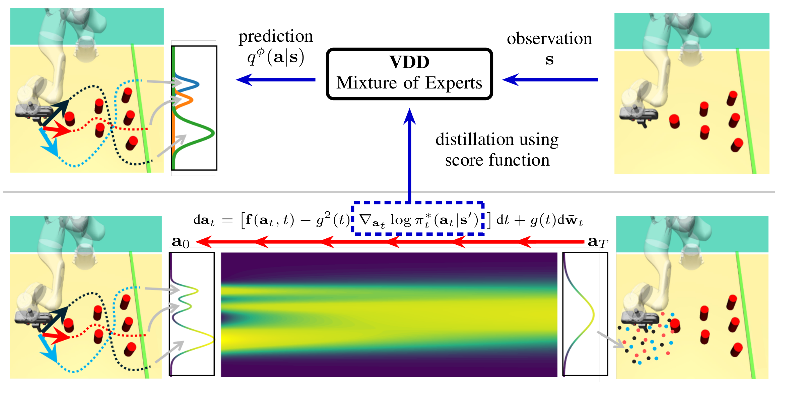

# [NeurIPS 2024] Official code for "Variational Distillation of Diffusion Policies into Mixture of Experts"
# (Under construction)



## Installation Guide

First create a conda environment using the following command

```bash
sh install.sh
```

During this process two additional packages will be installed:

- [Relay Policy Learning](https://github.com/google-research/relay-policy-learning)
- [BESO](https://github.com/intuitive-robots/beso)

To add relay_kitchen environment to the PYTHONPATH run the following commands:

```
conda develop <path to your relay-policy-learning directory>
conda develop <path to your relay-policy-learning directory>/adept_envs
conda develop <path to your relay-policy-learning directory>/adept_envs/adept_envs
```

**Dataset**

To download the dataset for the Relay Kitchen and the Block Push environment from the given link and repository, and adjust the data paths in the ```franka_kitchen_main_config.yaml``` and ```block_push_main_config.yaml``` files, follow these steps:

1. Download the dataset: Go to the [link](https://osf.io/q3dx2/) from [play-to-policy](https://github.com/jeffacce/play-to-policy) and download the dataset for the Relay Kitchen and Block Push environments.

2. Unzip the dataset: After downloading, unzip the dataset file and store it.

3. Adjust model paths in the configuration files:

For example, for franka kitchen. Open the ```./configs/vdd_beso_kitchen_config.yaml``` and set the model_path argument to ```[Path to Beso]/beso/trained_models/kitchen/c_beso_1```.

---
## Run Experiment
```
python scripts/training.py configs/<config_name>.yml 
```
For example, to run the 2D toy experiment, run the following command:
```
python scripts/training.py configs/vdd_toytask2d.yml
``` 
To run the experiment on the Franka Kitchen environment, run the following command:
```
python scripts/training.py configs/vdd_beso_kitchen.yml
```

---
### Acknowledgements

This repo relies on the following existing codebases:
- The beso implementation are based on [BESO](https://github.com/intuitive-robots/beso).
- The goal-conditioned variants of the environments are based on [play-to-policy](https://github.com/jeffacce/play-to-policy).
- the ```score_gpt``` class is adapted from [miniGPT](https://github.com/karpathy/minGPT).
---

## Citation

```bibtex
@article{zhou2024variational,
  title={Variational Distillation of Diffusion Policies into Mixture of Experts},
  author={Zhou, Hongyi and Blessing, Denis and Li, Ge and Celik, Onur and Jia, Xiaogang and Neumann, Gerhard and Lioutikov, Rudolf},
  journal={arXiv preprint arXiv:2406.12538},
  year={2024}
}
```

---